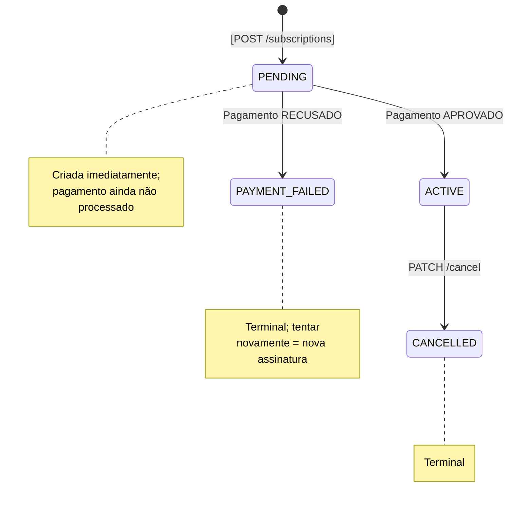
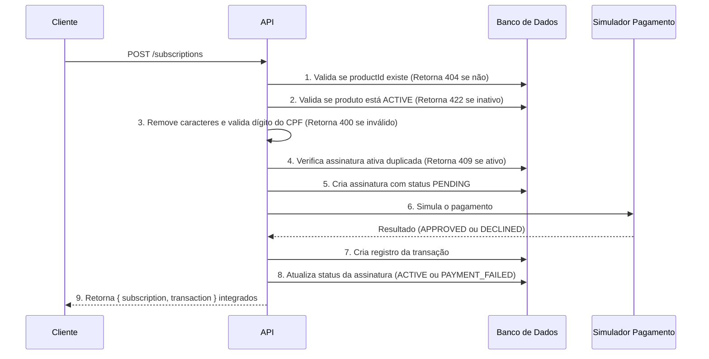

# Checkout de Assinatura Recorrente

Um sistema full-stack de assinaturas recorrentes. Os usuários navegam por um produto através de um link de checkout, assinam com um processamento de pagamento simulado e gerenciam suas assinaturas pelo seu número de CPF.

## Stack

| Camada         | Tecnologia                                      |
| -------------- | ----------------------------------------------- |
| Backend        | NestJS (strict mode), Mongoose, class-validator |
| Frontend       | React + Vite + TypeScript, Axios, React Router  |
| Banco de Dados | MongoDB 7 via Docker                            |

---

## Rodando o Projeto

### Pré-requisitos

- Node.js 18+
- Docker Desktop (para o MongoDB)
- npm

### 1. Iniciar o banco de dados

```bash
docker compose up -d
```

Isso inicia o MongoDB na porta 27017 com um volume nomeado para a persistência dos dados.

### 2. Backend

```bash
cd backend
npm install
npm run start:dev
```

O servidor do back inicia em http://localhost:3000.

### 3. Frontend

```bash
cd frontend
npm install
npm run dev
```

A aplicação inicia em http://localhost:5173.

### 4. (RECOMENDADO) Popular o banco de dados (Seed)

```bash
cd backend
npm run seed
```

Preenche o banco de dados com 4 produtos e 12 assinaturas distribuídas em 5 clientes de teste.
Veja [Dados de Seed](#dados-de-seed) para os números de CPF.

### Variáveis de Ambiente

Ambos os arquivos `.env` foram commitados com os valores padrão de desenvolvimento.
Nenhuma configuração manual é necessária para rodar localmente.

**`backend/.env`**

```
MONGODB_URI=mongodb://localhost:27017/veepag
PORT=3000
```

**`frontend/.env`**

```
VITE_API_URL=http://localhost:3000
```

---

## Referência da API

### Produtos

```
POST   /products                 Criar um produto
GET    /products                 Listar produtos (query: status, page, limit)
GET    /products/:id             Buscar produto por ID
PATCH  /products/:id             Atualizar produto
```

### Assinaturas (Subscriptions)

```
POST   /subscriptions                    Criar assinatura + executar pagamento
GET    /subscriptions                    Listar assinaturas (query: status, productId, page, limit)
GET    /subscriptions/customer/:cpf      Buscar todas as assinaturas de um CPF
PATCH  /subscriptions/:id/cancel         Cancelar uma assinatura
```

### Transações

```
GET    /transactions/subscription/:id    Buscar todas as transações de uma assinatura
```

---

## Simulação de Pagamento

O simulador de pagamento é baseado na abordagem de cartões de teste da Stripe.
Use os **últimos 4 dígitos** do cartão para acionar resultados diferentes:

| Últimos 4 Dígitos | Validade     | Resultado | Motivo               |
| ----------------- | ------------ | --------- | -------------------- |
| Qualquer          | Data passada | Recusado  | `card_expired`       |
| `0000`            | Válida       | Recusado  | `do_not_honor`       |
| `0002`            | Válida       | Recusado  | `insufficient_funds` |
| Qualquer outro    | Válida       | Aprovado  | —                    |

---

## Dados de Seed

Após rodar o comando `npm run seed`, os seguintes números de CPF podem ser utilizados na página "Minhas Assinaturas":

| Cliente         | CPF            |
| --------------- | -------------- |
| João Silva      | 529.982.247-25 |
| Maria Santos    | 111.444.777-35 |
| Carlos Oliveira | 987.654.321-00 |
| Ana Pereira     | 123.456.789-09 |
| Roberto Lima    | 321.654.987-91 |

## PS: os dados de seed foram criados para não ter que usar um CPF válido para testar.

## Decisões Técnicas

### Preço armazenado em centavos (integer)

Todos os valores monetários (`price`, `amount`) são armazenados como integers que representam a menor unidade da moeda (ex: R$29,90 → `2990` centavos). Isso elimina bugs de aritmética de ponto flutuante que se acumulam ao longo dos billing cycles. Esse é o padrão da indústria.Stripe, Adyen e a maioria dos processadores de pagamento operam da mesma forma.

### productSnapshot — desnormalizando no momento da criação

Quando uma assinatura é criada, os campos `name`, `price`, `currency` e `billingCycle` do produto são copiados para um campo `productSnapshot` dentro do documento da assinatura. Isto significa que:

- Se o preço de um produto for atualizado no futuro, as assinaturas existentes não serão afetadas — elas sempre cobrarão pelo snapshot.
- Se um produto for desativado, as assinaturas ativas continuam mantendo o seu histórico salvo.
- As transações derivam seu valor (`amount`) a partir do snapshot, e nunca diretamente do produto em tempo real.

Isso reproduz o funcionamento das assinaturas da Stripe e previne problemas de integridade de dados financeiros.

### CPF armazenado com 11 dígitos (sem formatação)

Todos os caracteres não numéricos do CPF são removidos antes de ser armazenado (ex: `123.456.789-09` → `12345678909`). Isso garante consistência para criação de índices e buscas, independentemente de como o usuário informou os dados. O checksum (dígito verificador) é validado do lado do servidor utilizando o algoritmo padrão de validação de dois dígitos.

### Ausência da entidade Customer (Cliente)

Os dados do cliente (`name`, `email`, `CPF`) são capturados por assinatura em vez de serem mantidos em uma collection separada de Clientes (Customer). Neste escopo, uma entidade de Customer apenas adicionaria complexidade de joins (relacionamentos) sem um benefício real. O CPF funciona como o identificador do cliente para a funcionalidade de buscar "Minhas Assinaturas".

### Padrão Repository

O acesso ao banco de dados está isolado em classes `*.repository.ts`. Os services apenas chamam os métodos do repository. Eles nunca interagem com o Mongoose diretamente. Isso torna os testes unitários mais simples: os services são testados construindo mocks dos repositories, sem a necessidade de um banco de dados rodando.

### Índices compostos sobre múltiplos índices simples

- **Produtos**: `{ status: 1, createdAt: -1 }` — um único índice atende tanto a filtragem de status quanto a ordenação de datas. Uma consulta usando somente `status` utiliza a regra de prefixo da esquerda (left-prefix rule), tornando redundante a criação de um índice separado de `{ status: 1 }`.
- **Assinaturas**: `{ customerCpf: 1, productId: 1, status: 1 }` — este índice único cobre a checagem de exclusão de assinaturas ativas duplicadas (utiliza todos os três campos) bem como atende a busca de "Minhas Assinaturas" por CPF utilizando a regra de prefixo. Um índice isolado apenas em `{ customerCpf: 1 }` seria redundante.

### As transações estão em uma collection separada (não embarcadas)

Embarcar (embed) as transações dentro dos documentos das assinaturas causaria um crescimento descontrolado dos documentos na medida que as cobranças acumulam registros de renovação ao longo do tempo. Documentos do MongoDB têm um limite máximo ("hard cap") de 16MB; na prática, documentos pesados degradam a performance de leitura/escrita. Por isso, as transações estão em sua própria collection e são pesquisadas pela propriedade `subscriptionId`.

### Mentalidade PCI-DSS (Payment Card Industry Data Security Standard) na simulação

Mesmo se tratando de uma simulação de pagamento, apenas os últimos 4 dígitos e a bandeira do cartão são armazenados. Optei por não armazenar o número completo ou o CVV.
Isso estabelece a boa prática de segurança correta desde o início.

### useReducer para as state machines do frontend

Cada página gerencia o seu próprio estado usando um `useReducer` em vez de hooks flags ad-hoc via `useState`. Isso torna os possíveis estados explícitos e conclusivos:

- **Checkout**: `loading → product_loaded → submitting → result`
- **My Subscriptions**: `idle → loading → loaded → cancelling`

Combinações inválidas de estados (como por exemplo "submitting without a product") são assim estruturalmente impossíveis.

---

## Regras de Negócio

### Ciclo de vida da assinatura



**Regras de transição dos estados:**

- Apenas assinaturas nos status `ACTIVE` e `PENDING` podem ser canceladas. Tentar cancelar uma assinatura com status `CANCELLED` ou `PAYMENT_FAILED` vai retornar o erro `409 Conflict`.
- `PAYMENT_FAILED` é terminal. Não existe uma forma de tentar cobrar de novo a mesma assinatura. O cliente precisará criar uma nova assinatura.

### Prevenção de assinaturas duplicadas

Antes de criar uma assinatura, o repository da subscription verifica se o mesmo e-mail (ou o cliente/CPF) já possui uma assinatura com status `ACTIVE` para aquele mesmo `productId`. Caso possua, o service dispara o erro `409 Conflict`. A funcionalidade se aproveita do índice composto `{ customerCpf, productId, status }` nativamente.

### Fluxo de Checkout (Orquestração em SubscriptionsService.create)



### Validação de CPF

A validação completa com os dois checksums (dígitos numéricos verificadores) do Brasil é processada tanto no backend, quanto no frontend:

1. Remove todos os caracteres não numéricos.
2. Rejeita se não tiver exatamente 11 dígitos.
3. Rejeita se todos os dígitos forem idênticos (ex: `00000000000`).
4. Calcula o primeiro dígito verificador usando a soma ponderada módulo 11.
5. Calcula o segundo dígito verificador usando a mesma métrica matemática sobre os ditos acima.
6. Rejeita imediatamente em caso de erro nos dois checadores finais validados.

### Códigos HTTP de Erro

| Condição                                                    | Código HTTP                |
| ----------------------------------------------------------- | -------------------------- |
| Produto não encontrado                                      | `404 Not Found`            |
| Produto está INATIVO                                        | `422 Unprocessable Entity` |
| Formato ou Checksum do CPF inválidos                        | `400 Bad Request`          |
| Assinatura ativa ou Duplicada                               | `409 Conflict`             |
| Assinatura não encontrada                                   | `404 Not Found`            |
| Cancelamento de uma assinatura que não pode ser cancelada   | `409 Conflict`             |
| Corpo da Requisição inválido devido problemas com o payload | `400 Bad Request`          |

---

## Rodando os Testes

```bash
cd backend
npm run test          # Roda todos os testes unitários
npm run test:cov      # Roda com o relatório de cobertura de código
```

Os testes abrangem:

- `ProductsService`: criação (happy path), criação (falha na validação), busca (findById = não achou)
- `SubscriptionsService`: não detectou um produto, inatividade num produto, assinaturas contendo erro duplicadas pelo sistema, pagamento em vias de ser aprovação e de declinação/recuso, caminho de sucesso no estorno (cancelamentos do registro), já encontrava ela e as retornas não e para testes e evitar que a assinatura duplique (quando a simulação estiver `cancelled`)
- `PaymentSimulatorService`: Transações aprovadas, de erro para o vencimento de validade em datas (card_expired), não honrado o cartão/fraudes de autorizações recusando com (0000 no erro "do_not_honor"), com insuficiência nos fundos caso falhou por "insufficient_funds" via "0002"
- `CpfUtils`: Testes contra a lógica como (Válido / falho por não número certo / tamanho da soma falho da checksum errada ou a formatação, todos repetido nos número igual no mesmo limite como '0000/111/').

---

## O Que Melhoraríamos Com Mais Tempo

### Criação atômica de assinatura + transação

Atualmente o fluxo de checkout cria a assinatura, então roda o pagamento, e depois atualiza o status da assinatura. Se o processo quebrar entre os passos, o banco de dados pode ficar em um estado inconsistente (ex: uma assinatura PENDING sem nenhuma transação associada). Com mais tempo, isso seria encapsulado em uma **transaction multi-documento do MongoDB** (`session.withTransaction()`), garantindo a atomicidade.

### Faturamento de renovação (Renewal billing)

A máquina de estados da assinatura possui um caminho natural de expansão: de `ACTIVE → PENDING` quando um ciclo de faturamento termina, com um job em background (usando `@nestjs/schedule` no NestJS) rodando o simulador de pagamento contra o `productSnapshot` armazenado. Isso é suportado em termos de arquitetura pelo modelo de dados atual — o snapshot captura tudo o que é necessário para cobrar novamente — mas ficou fora do escopo deste MVP pela falta de tempo mesmo.

### Autenticação de clientes

Atualmente, as assinaturas são buscadas via CPF sem nenhuma etapa de autenticação. Um sistema real exigiria que o cliente se autenticasse (via OTP no email, magic link, ou auth completo) antes de acessar os dados da assinatura. O CPF serve como um mecanismo de descoberta da informação, e não como um mecanismo de controle de acesso.

### Chaves de Idempotência (Idempotency keys)

O endpoint `POST /subscriptions` não possui proteção de idempotência. Se o cliente tentar reenviar uma requisição (ex: devido a um timeout na resposta), uma assinatura duplicada pode acabar sendo criada. A adição de um header `Idempotency-Key` (Chave de idempotência) mapeado para uma resposta em cache em uma janela curta de tempo preveniria isso.

### Unique index para proteção de race condition

A verificação para não criar uma assinatura ativa duplicada está ao nível da aplicação. Sob requisições concorrentes, duas chamadas simultâneas ao `POST /subscriptions` com o mesmo CPF + produto poderiam ambas passar pela verificação antes que qualquer uma persistisse os dados. Usar um unique partial index no MongoDB nos campos `{ customerCpf, productId }` onde a condição fosse `status = ACTIVE`, combinado com o tratamento de erros do tipo "duplicate-key error" que retorne o erro `409`, tornaria a garantia à prova de falhas.

### Paginação nas assinaturas do cliente

O endpoint `GET /subscriptions/customer/:cpf` no momento retorna todas as assinaturas sem aplicar paginação. Para clientes com históricos longos, isto poderia se tornar processamento muito caro. Adicionar os parâmetros de query string como `page` e `limit` (que já foram implementados na rota geral de listagem em `/subscriptions`) cobriria isso, sendo uma extensibilidade bem pontual.

### Sistema de eventos / Webhook

Os resultados do pagamento (aprovado, recusado) deveriam, em um cenário ideal, serem comunicados via eventos (ex: lançando `subscription.activated` ou `payment.failed`) ao invés de estarem fortemente acoplados dentro do service da assinatura. O uso de um event emitter ou uma fila de mensagens para desassociar as diretrizes do resultado de pagamento das ações de atualização de status tornaria o sistema amigável à sua escalabilidade e adaptável sob o uso dele no futuro (ex: para o cenário no envio automático de confirmação num email no evento da ativação da sua assiantura).

### Suporte a múltiplas moedas (Multi-currency)

O campo `currency` (moeda) existe dentro dos produtos e transações porém apontam fixas para BRL. A base do trabalho no `productSnapshot` e `product` possui estes tipos inseridos e permitiria dar suporte a isso sem modelar nem alterar base de banco de dados, configurando moedas nos roteamentos ou sistema de suporte de câmbios futuros se necessário.
